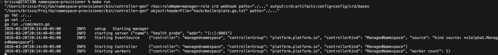
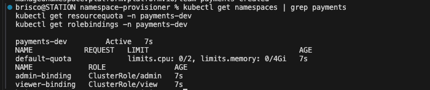

# Namespace Provisioner Operator

A Kubernetes operator that enforces consistent, policy-compliant namespace provisioning across clusters. Instead of manually creating namespaces and hoping engineers follow standards, the operator guarantees every provisioned environment has the correct RBAC, resource quotas, and labels applied automatically.

## The Problem

In large Kubernetes environments, namespaces get created ad hoc -- missing resource limits, inconsistent RBAC, no ownership labels. Over time you end up with unmanaged environments consuming cluster resources with no accountability. This operator solves that by making namespace creation declarative and policy-enforced.

## How It Works

Define a `ManagedNamespace` resource. The operator reconciles it into a fully configured environment automatically.
```yaml
apiVersion: platform.platform.io/v1alpha1
kind: ManagedNamespace
metadata:
  name: team-payments
  namespace: default
spec:
  team: payments
  environment: dev
  resourceQuota:
    cpu: "2"
    memory: "4Gi"
  rbac:
    admins:
      - alice
    viewers:
      - bob
```

The operator provisions:
- A namespace named `<team>-<environment>` with ownership labels
- A ResourceQuota enforcing CPU and memory limits
- RoleBindings for admin and viewer access using Kubernetes built-in ClusterRoles

**Drift correction:** If a RoleBinding or ResourceQuota is manually deleted or modified, the operator recreates it on the next reconciliation cycle. Desired state always wins.

**Deletion:** Deleting a `ManagedNamespace` resource removes the provisioned namespace and all owned resources via Kubernetes garbage collection. The controller sets owner references on all created resources so cleanup is automatic.

## Architecture
```
ManagedNamespace CRD applied
        ↓
Controller detects change via watch
        ↓
Reconciliation loop runs
        ├── reconcileNamespace      — creates namespace with labels
        ├── reconcileResourceQuota  — enforces CPU and memory limits
        └── reconcileRBAC           — creates admin and viewer RoleBindings
                ↓
        Controller re-queues on any change
                ↓
        Drift detected — recreates missing or modified resources
```

## Repository Structure
```
namespace-provisioner/
├── api/v1alpha1/
│   └── managednamespace_types.go               # CRD type definitions
├── internal/controller/
│   ├── managednamespace_controller.go          # Reconciliation logic
│   └── managednamespace_controller_test.go     # Controller tests (70.2% coverage)
├── config/
│   ├── crd/bases/                              # Generated CRD manifests
│   ├── rbac/                                   # Operator RBAC permissions
│   └── samples/                               # Example ManagedNamespace manifests
├── cmd/
│   └── main.go                                # Operator entrypoint
└── Dockerfile                                 # Container image
```

## Prerequisites

- Go 1.21+
- kubectl
- kind (for local development)
- kubebuilder

## Running Locally

### 1. Install the CRD
```bash
make install
```

### 2. Run the operator
```bash
make run
```

### 3. Apply a sample manifest
```bash
kubectl apply -f config/samples/platform_v1alpha1_managednamespace.yaml
```

### 4. Verify
```bash
kubectl get namespaces | grep payments-dev
kubectl get resourcequota -n payments-dev
kubectl get rolebindings -n payments-dev
```

### 5. Verify drift correction
```bash
# Delete a RoleBinding manually
kubectl delete rolebinding admin-binding -n payments-dev

# Operator recreates it within seconds
kubectl get rolebindings -n payments-dev
```

## Running Tests
```bash
make test
```

Current coverage: 70.2%




## Design Decisions

**Why Kubebuilder?**
Kubebuilder is the industry standard framework for building Kubernetes operators in Go. It generates the boilerplate for CRD registration, RBAC markers, and controller setup, letting you focus on reconciliation logic.

**Why a separate operator instead of scripts or Helm?**
Scripts and Helm charts create resources once -- they don't watch for drift. If someone manually deletes a RoleBinding or modifies a quota, nothing corrects it. An operator continuously reconciles desired state against actual state, making enforcement automatic and self-healing. This is the core value of the operator pattern.

**What happens when you delete a ManagedNamespace?**
The controller sets owner references on all created resources. When the ManagedNamespace is deleted, Kubernetes garbage collection automatically removes the provisioned namespace, ResourceQuota, and RoleBindings. No manual cleanup required.

**Why require admins but make viewers optional?**
Every namespace needs at least one accountable owner. Viewers are optional -- not every team needs read-only access configured on day one.

**Why `<team>-<environment>` naming convention?**
Enforces a consistent naming standard across the cluster. A namespace named `payments-dev` is immediately identifiable by team and environment without needing to inspect labels.

## Part of a Platform Engineering Portfolio

- **[namespace-provisioner](https://github.com/SmartBrisco/namespace-provisioner)** — Kubernetes operator for policy-enforced namespace provisioning (this repo)
- **[gitops-infra-pipeline](https://github.com/SmartBrisco/gitops-infra-pipeline)** — Multi-cloud Terraform with Kargo progressive delivery, security gates, and manual approval across AWS, GCP, and Azure
- **[argo-event-pipeline](https://github.com/SmartBrisco/argo-event-pipeline)** — Event-driven CI/CD pipeline with AI-powered failure analysis
- **[platform-observability](https://github.com/SmartBrisco/platform-observability)** — Unified observability with OpenTelemetry, Jaeger, Prometheus, and Grafana
- **[Platform](https://github.com/SmartBrisco/Platform)** — One command to spin up the full platform locally